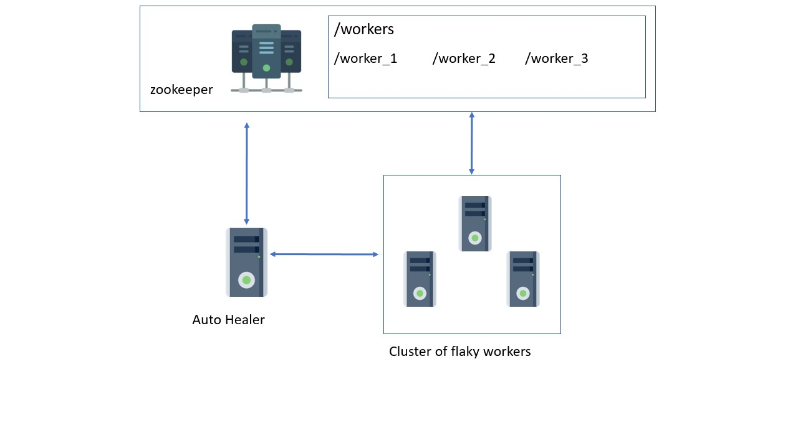

# Autohealer

This simulates how Zookeeper can be used to keep a watch on worker applications. 

There are two projects:
| Project| Description          |
| ------------- |:-------------:|
| Autohealer      |Autohealer uses zookeeper to maintain a minimum number of worker applications running. This keeps a watch on the zookeeper to check the number of running workers. When the number goes below the threshold, the Autohealer initiates worker applications |
| flakyworker     | This is the node application which simulates a faulty application, which keeps crashing at random time      |

