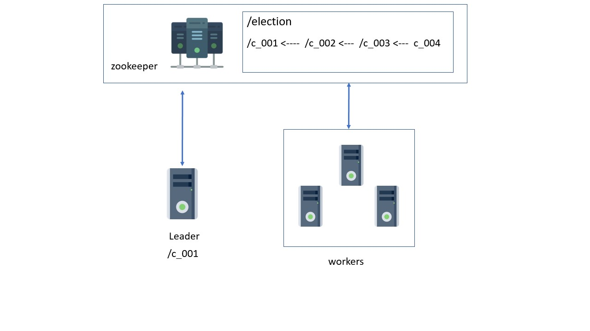

# Leader Election

* To elect a leader among the nodes, each node creates a znode under /election and gets a serial number.
* The node with the least serial number declares itself as the leader
* Each node observes the node with serial number before it as shown in the diagram
* If the leader fails, the node observing it will become the leader
* If the failed node comes back up, it registers itself again and starts observing the znode registered before it. 

 
 

