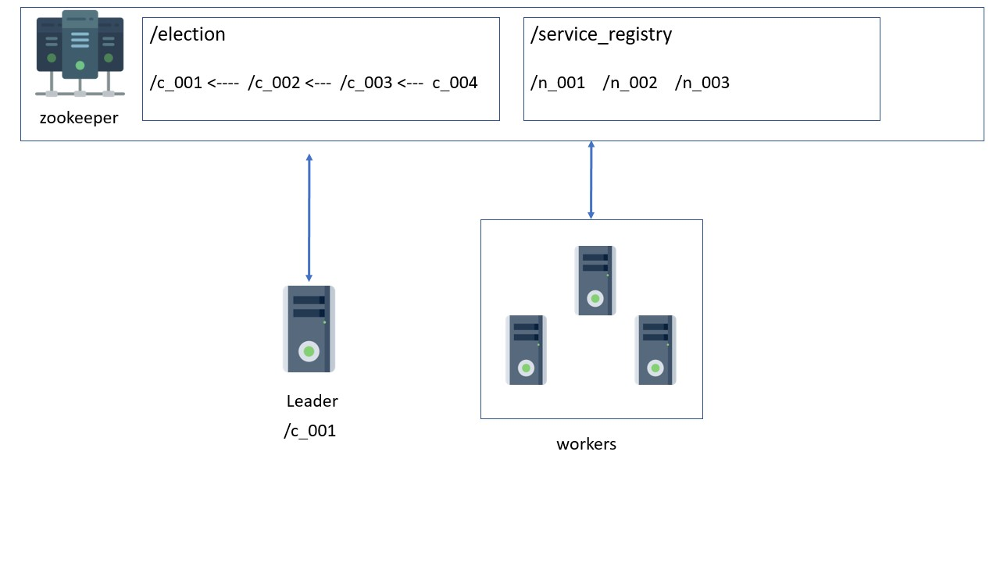

# Service Registry

This builds upon the [leader election project](https://github.com/codebleeder/distributed-systems/tree/master/cluster-coordination-zookeeper/leaderelection)

* In addition to leader election, all nodes except the leader node, register themselves under /service_registry with their address as data 
* Through this service registry, the leader node can then keep track of worker nodes 
* When the leader node goes down, the re-election happens. 
* On re-election, the new leader node removes itself from /service_registry since it is not a worker node anymore 

 
 

